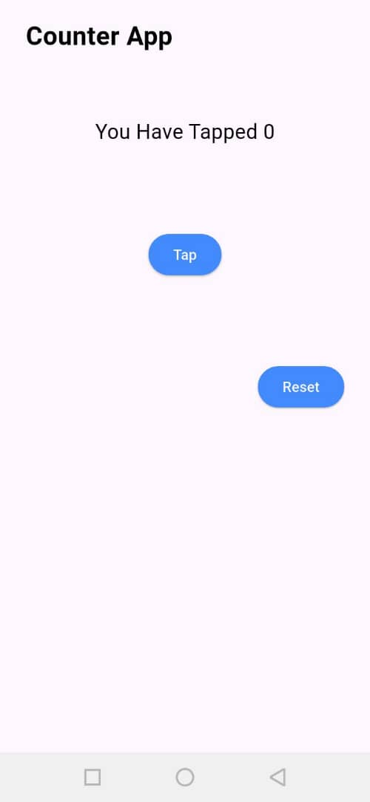

# Flutter Counter App

This is a simple **Flutter app** that demonstrates basic state management using `StatefulWidget`.

## ✨ Features

- Count how many times a button is tapped
- Reset the counter to zero
- Custom button styling and layout

## 🧠 What I Learned

- How to use `StatefulWidget` and `setState`
- Layout with `Column`, `Row`, and `Center`
- Basic Flutter UI styling

## 📸 Screenshots



## 🚀 Getting Started

Clone the repo and run it:

```bash
git clone https://github.com/your-username/flutter-counter-app.git
cd flutter-counter-app
flutter pub get
flutter run
